 

# 项目设计文档

# 目录

- ### **一、项目要求**

- ### **二、项目架构设计**

- ### **三、核心流程设计**

- ### **四、游戏运行流程**


# 一、项目要求

### 需求1：手牌区翻牌替换

点击手牌区（StackField）除了顶部牌之外的牌，该牌会平移到手牌区的顶部位置，替换原有的顶部牌成为新的顶部牌。例如：点击手牌区的♥A（除顶牌外最上面的牌），♥A会平移到顶部牌位置，替换原有的顶部牌。

### 需求2：桌面牌与手牌区顶部牌匹配

点击桌面牌区（PlayField）的牌，如果该牌与手牌区顶部牌的点数差1，则可以匹配。匹配规则为：点数差1即可（无花色要求）。点击后，桌面牌会平移到手牌区顶部，替换原有顶部牌。例如：桌面牌♦3与手牌区顶部牌♣4点数差1，点击后♦3会移动到顶部。

### 需求3：回退功能

提供撤销功能，可以回退之前的操作。场景示例：点击♦3 -> 点击♥A -> 点击♠2 后，连续多次点击回退按钮，各卡牌需要按相反顺序平移回原位置，直到无回退记录可回退。

### 项目架构

本项目采用MVC（Model-View-Controller）架构设计，结合Cocos2d-x游戏引擎进行开发。项目结构如下：

| **目录**     | **说明**                                     |
| ------------ | -------------------------------------------- |
| configs/     | 配置文件，包括关卡配置和卡牌资源配置         |
| models/      | 数据模型，包括卡牌模型、场地模型、游戏模型等 |
| views/       | 视图层，包括卡牌视图、场景视图等             |
| controllers/ | 控制器层，处理用户交互和业务逻辑             |
| managers/    | 管理器层，包括撤销管理、映射管理等           |
| services/    | 服务层，提供纯业务逻辑服务                   |
| utils/       | 工具层，提供通用辅助函数                     |

架构设计原则：单一职责原则（SRP），每个类只负责一个明确的职责；依赖倒置原则，上层模块依赖于抽象，而不是具体实现。


#  二、项目架构设计

## Models层

Models层负责数据存储和业务逻辑。

CardModel, FieldModel, GameModel主要对卡牌信息进行保存。


UndoModel主要存储撤销类型和撤销步对应的信息

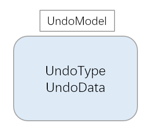

#### CardModel（卡牌数据模型）

存储单张卡牌的基本信息，包括卡牌ID、花色、点数和位置。

在创建视图的时候，花色用于选择显示红色图片还是黑色图片。

点数用于判断桌面牌与手牌中顶牌点数的差值。

坐标用于保存每个卡片的坐标（便于存档与恢复）

```cpp
// models/CardModel.h
namespace models {
    struct CardModel {
        int cardId = -1;              // id
        CardSuitType suit = CST_NONE; // 花色
        CardFaceType face = CFT_NONE; // 点数
        cocos2d::Vec2 position;       // 坐标
        CardModel() = default;
        CardModel(int id, CardSuitType s, CardFaceType f, cocos2d::Vec2 pos = cocos2d::Vec2::ZERO)
            : cardId(id), suit(s), face(f), position(pos) {}
    };
}
```


#### FieldModel（场地模型）

场地模型，存储对应场地有哪些CardModel

```cpp
// models/FieldModel.h
class FieldModel {  
    std::vector<CardModel*> _cards; // 存储对应区域内的卡牌模型
    
    // 对区域卡牌模型清空 如切换关卡时候
    void reset() { 
        for (auto c : _cards) delete c;
        _cards.clear();
    }

    ~FieldModel() { reset(); }
}
```


#### GameModel（游戏模型）

游戏的主模型，包含桌面区和手牌区卡牌数据。

```cpp
// models/GameModel.h
class GameModel {
public:
    FieldModel* _playFieldModel = nullptr; // 桌面区
    FieldModel* _stackFieldModel = nullptr; // 手牌区

    GameModel() {
        _playFieldModel = new FieldModel();
        _stackFieldModel = new FieldModel();
    }

    void reset() {
        if (_playFieldModel) _playFieldModel->reset();
        if (_stackFieldModel) _stackFieldModel->reset();
    }

    ~GameModel() {
        if (_playFieldModel) { _playFieldModel->reset(); delete _playFieldModel; }
        if (_stackFieldModel) { _stackFieldModel->reset(); delete _stackFieldModel; }
    }
};
```


#### UndoModel（撤销模型）

定义撤销类型和撤销步骤数据结构。

由于有多种撤销操作，所以每种撤销操作需要创建单独的UndoType，才能在执行撤销的时候根据UndoType分别执行逻辑。此外还需要存储需要恢复的数据信息

```cpp
// models/UndoModel.h
namespace models{
    enum UndoType 
    { 
        PlayToStack, 
        BottomToTop 
    }; 

    struct UndoStep 
    {   
        UndoType type;   
        Vec2 oldPos;   // 原视图的坐标
        int zorder;    // 原视图的zOrder
    }
}

```

 

## Views层

Views层负责界面渲染和用户交互，基于Cocos2d-x的Node系统实现。

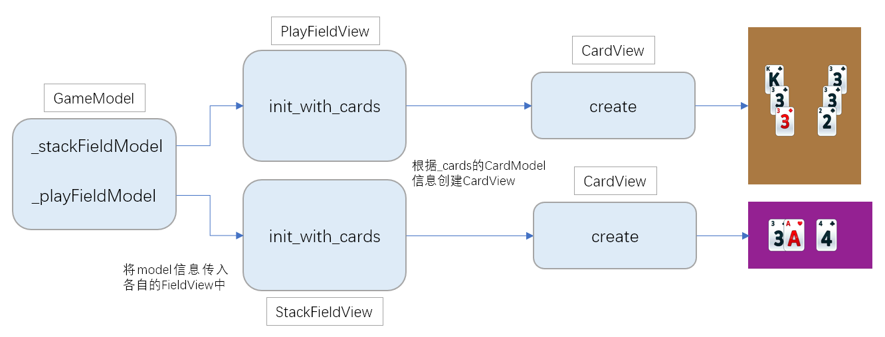

其中GameView仅存在作为PlayFieldView和StackFieldView的父节点，并提供显示Undo撤销按钮

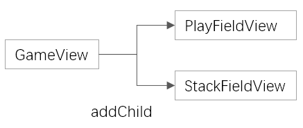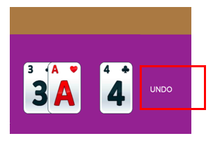


#### CardView（卡牌视图）

单张卡牌的视觉表现，包含背景、数字、花色等元素。

| **函数名**                     | **功能说明**                                 |
| ------------------------------ | -------------------------------------------- |
| create(data)                   | 静态工厂方法，创建卡牌视图                   |
| init(data)                     | 初始化卡牌外观，加载贴图                     |
| moveToPosition(pos,  duration) | 移动卡牌到指定位置的动画, 播放时间为duration |


#### GameView（游戏主视图）

游戏的主视图，是 PlayFieldView 和 StackFieldView 的父节点，包含撤销按钮和卡牌容器。

| **函数名**            | **功能说明**             |
| --------------------- | ------------------------ |
| init()                | 初始化场景，创建撤销按钮 |
| setOnUndoCallback(cb) | 设置撤销按钮回调         |


#### PlayFieldView（桌面区视图）

桌面卡牌区域的视觉表现，处理桌面卡牌的点击事件，对 PlayField 区域的 CardView cardId CardModel的映射管理器添加数据。

主要函数：

```cpp
// views/PlayFieldView
namespace views {
    class PlayFieldView : public cocos2d::Node {
    public:

        CREATE_FUNC(PlayFieldView);
        virtual bool init() override; // 添加背景颜色，设定PlayField区域大小

        void initWithCards // 根据CardModel 创建每个卡片的CardView视图 并添加点击监听
        (
            const std::vector<models::CardModel*>& cards, // PlayField 对应的 cardModels
            managers::CardDataMapManager* cardMapManager  // 创建CardView cardId CardModel的映射关系
        );

        void removeCardView(views::CardView* cardView); // 向外提供删除CardView视图的函数

        void setOnCardClickCallback // 设计点击监听的回调, 点击时回传CardView
        (
            std::function<void(views::CardView* cardView)> callback
        );
    }
}
```


#### StackFieldView（手牌区视图）

手牌区域的视觉表现，管理顶部牌和底牌的显示，对 StackField 区域的 CardView cardId CardModel的映射管理器添加数据。

主要函数：

```cpp
namespace views {

    class StackFieldView : public cocos2d::Node {
    public:
        

        CREATE_FUNC(StackFieldView);
        virtual bool init() override;

        void initWithCards(
            const std::vector<models::CardModel*>& cards, // StackField 对应的 cardModels
            managers::CardDataMapManager* cardMapManager  // 创建CardView cardId CardModel的映射关系
        );
        
        // 设置手牌区域的回调函数
        void setOnBottomCardClickCallback(std::function<void(CardView*)> callback) {
            _onBottomCardClickCallback = callback;
        }
        void addTopCardView(CardView* cardView); 				// 向外部提供添加某张牌到顶牌的函数
        void removeBottomTopCard();              				// 向外部提供移除手牌的第一张牌（除顶牌以外）的函数
        void popTopCardView();                   				// 向外部提供移除顶牌的函数
        void addBottomCardView(CardView* cardView, int zOrder); // 向外部提供添加手牌视图的（用于撤销手牌移动）函数

        CardView* getTopBottomCardView() const;                 // 向外部提供获得手牌第一张卡牌（除顶牌以外）的函数
        CardView* getTopCardView() const;                       // 向外部提供获得当前顶牌的函数
    };
}

```

 

## Controllers层

Controllers层负责业务逻辑控制，协调Models和Views之间的交互。

在创建了 PlayFieldView 以及 StackFieldView之后，可以创建 Controller 并使用对应的 FieldView 的实现游戏逻辑。


#### GameController（游戏主控制器）

```cpp
// controllers/GameController
namespace controllers {
    class GameController {
    public:
        GameController();
        ~GameController();

        /*
         * 开始游戏入口
         * 1. 根据 levelId 读取关卡配置信息 
         * 2. 创建主GameView 并 根据关卡配置初始化 PlayFieldController 以及 StackFieldController
         */
        void startGame(int levelId); 
        views::GameView* getGameView() { return _gameView; } // 向外部返回游戏主视图的函数

    private:
        void onUndoPressed(); // 点击撤销按钮后的逻辑

    private:
        
        
        models::GameModel* _gameModel; // 包括 StackFieldModel 以及 PlayFieldModel 
        views::GameView* _gameView;    // 游戏主视图，PlayFieldView 以及 StackFieldView 的父节点

        PlayFieldController* _playFieldController;
        StackFieldController* _stackController;
        managers::UndoManager* _undoManager;  // 撤销功能管理
    };
}
```


#### PlayFieldController（桌面区控制器）

处理桌面卡牌的点击事件，实现桌面牌到手牌区的移动逻辑。

```cpp
// controllers/PlayFieldController
namespace controllers {
	class PlayFieldController {
	public:
		PlayFieldController() = default;
		~PlayFieldController() = default;
		
        /*
		* 初始化 PlayFieldController
		* 1. _playFieldModel 初始化
		* 2. 设置自己为 parent（由 GameController 传入 GamveView）的Child
		* 3. 初始化 _cardMap 并让 _playFiedView 为 _cardMap 添加该区域 cardId, CardView, CardModel之间的映射关系
		* 4. 传入 _playFieldModel->cards 初始化 _playFiedView 并为其设置卡牌监听回调为 handleCardClick
		* 5. 设置 undoManager 作为 _undoManager
		*/
		void init(
			models::FieldModel* playFieldModel,
			cocos2d::Node* parent,
			const cocos2d::Vec2& position,
			managers::UndoManager* undoManager
		);

		void setStackController(controllers::StackFieldController* stack); // 引用 StackController 为
		void undoMoveFromStack(models::UndoStep step);                     // 撤销 PlayField

	private:
        void handleCardClick(views::CardView* cardView); // 设置 PlayFieldView 卡牌回调函数为 handleCardClick
        
        // 判断是否可移动到底牌，调用services::CardRuleService::canLink(cardModel->face, stackTopCard->face);
		bool canMoveToStack(views::CardView* cardView, models::CardModel* cardModel);
        
        // 执行将 PlayField 卡牌移动到 StackField 顶牌的逻辑
		void replaceTrayWithPlayFieldCard(views::CardView* cardView, models::CardModel* cardModel);
        

	private:
		views::PlayFieldView* _playFieldView = nullptr;
		controllers::StackFieldController* _stackController = nullptr;

		models::FieldModel* _playFieldModel = nullptr;
		managers::UndoManager* _undoManager = nullptr;
		managers::CardDataMapManager* _cardMap = nullptr;
	};

}

```


#### StackFieldController（手牌区控制器）

处理手牌区的逻辑，包括顶牌管理、底牌翻牌和撤销操作。

```cpp
// controllers/StackFieldController
namespace controllers {

    class StackFieldController {
    public:
        StackFieldController() = default;
        ~StackFieldController() = default;
		
       /*
       * 初始化 StackFieldController
       * 1. _stackFieldModel 初始化
       * 2. 设置自己为 parent (GameController传进的GameView) 的Child
       * 3. 初始化 _cardMap 并让 _playFiedView 为 _cardMap 添加该区域 cardId, CardView, CardModel之间的映射关系
       * 4. 传入 _stackFieldModel->cards 初始化 _stackFiedView 并设置卡牌监听回调为 bringBottomCardToTop
       */
        void init(
            models::FieldModel* stackFieldModel,
            cocos2d::Node* parent,
            const cocos2d::Vec2& position,
            managers::UndoManager* undoManager
        );
        
        // 向外部提供添加顶部牌的函数
        void StackFieldController::pushCardToTop(
            views::CardView* cardView, 
            const cocos2d::Vec2& worldPos, 
            const models::CardModel* cardModel
        );
        
        // 撤销将手牌移动到顶牌
        void undoBottomToTop(models::UndoStep step);
        
        // 向外部提供从 StackField 删除某张卡片的功能
        void removeCardModel(const models::CardModel* card);
        
        // 移除顶部牌的功能 (撤销操作时，需要先移除顶部牌)
        void popTopCardView();
        
        // 从 StackField 中移除某个卡片 (对 PlayField 卡片移动到 StackField 顶牌进行撤销，需要讲卡牌从 StackField 移除)
        void removeCardView(views::CardView* cardView);
		
        // 获得顶部卡牌 CardView 视图 (撤销操作，返回应该撤销的顶部卡牌View )
        views::CardView* getTopCardView();
        
        // 获得顶部卡牌 CardModel 信息 (判断 PlayField 卡牌是否可移动时候，需要获取 StackField 顶牌信息)
        models::CardModel* StackFieldController::getTopCardModel() ;

    private:
        // 将最上面的手牌（除顶牌以外）移动到顶牌的逻辑
        void bringBottomCardToTop(views::CardView* cardView);
        
    private:
        views::StackFieldView* _stackView = nullptr;
        models::FieldModel* _stackFieldModel;
        managers::UndoManager* _undoManager = nullptr;
        managers::CardDataMapManager* _cardMap = nullptr;
    };
}

```


## Managers层

Managers层提供全局管理功能，通常作为单例或全局实例使用。


#### UndoManager（撤销管理器）

管理撤销操作的历史记录，采用栈结构存储操作步骤。

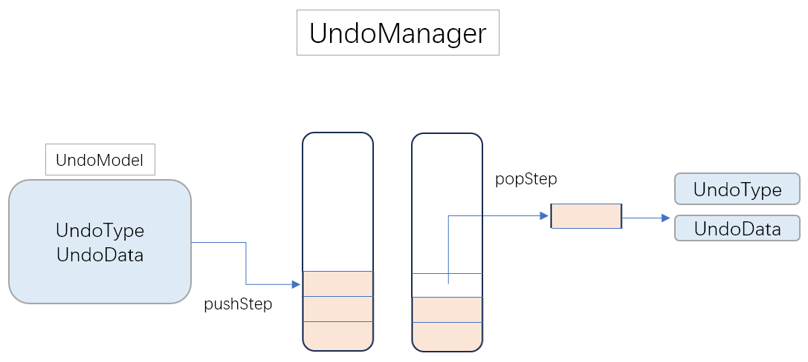

| **函数名**     | **功能说明**                     |
| -------------- | -------------------------------- |
| pushStep(step) | 将操作步骤压入栈                 |
| canUndo()      | 根据栈是否为空，检查是否可以撤销 |
| popStep()      | 弹出上一步操作                   |

```cpp
// managers/UndoManager
namespace managers {
    class UndoManager {
    public:
        
        void pushStep(const models::UndoStep& step); // 将操作步骤压入栈  
        bool canUndo() const;                        // 根据 _undoStack 是否为空，检查是否可以撤销 
        models::UndoStep popStep();                  // 弹出上一步操作

    private:
        
        std::stack<models::UndoStep> _undoStack;     // 存储撤销操作的栈
    };
}
```


#### CardDataMapManager（卡牌映射管理器）

管理卡牌ID、数据模型和视图之间的映射关系，方便快速查找。

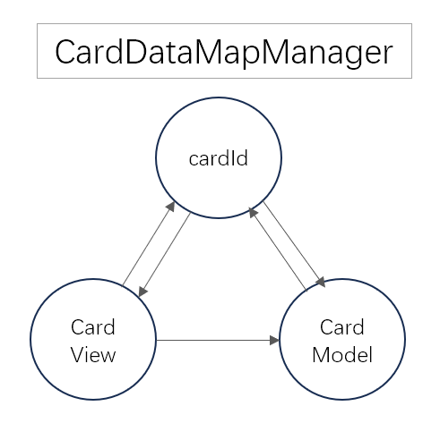

```cpp
// managers/CardDataMapManager
namespace managers
{
    class CardDataMapManager : public cocos2d::Ref {
    public:
        CardDataMapManager();
        ~CardDataMapManager();

        // 添加数据
        void addCardModel(models::CardModel* model, int cardId); // 建立 cardId -> CardModel*的映射
        void addCardView(views::CardView* view, int cardId);     // 建立 cardId -> CardView* -> cardId的映射

        // 查询数据
        models::CardModel* getModel(int cardId);                 // 查询 cardId 对应的 CardModel
        models::CardModel* getModel(views::CardView* view);      // 查询 cardView 对应的 CardModel
        
        views::CardView* getView(int cardId);                    // 查询 cardId 对应的 CardView
        int getCardId(views::CardView* view);                    // 查询 cardView 对应的 cardId

        // 删除数据
        void removeCard(int cardId);                     // 删除cardId对应的在CardDataMapManager中所有数据
        void clear();                                    // 清空

    private:
        // cardId->view cardId->model view->cardId
        cocos2d::Map<int, views::CardView*> _idToView;
        std::unordered_map<int, models::CardModel*> _idToModel;
        std::unordered_map<views::CardView*, int> _viewToId;

    };
}
```


## Services层

Services层提供纯业务逻辑服务，不依赖于具体的视图或控制器。


#### GameModelFromLevelGenerator（关卡生成器）

根据关卡配置生成游戏模型数据，填充桌面区和手牌区的卡牌。由GameController调用

```cpp
// services/GameModelFromLevelGenerator
namespace services
{
    class GameModelFromLevelGenerator {
    public:
		
        /*
        * 根据 LevelConfig 进行读取关卡信息并存储到 GameModel中, 为每个CardModel 提供全局的 cardId
        * 由GameController调用，传入gameModel
        * 
        * 1.根据 config 信息生成 PlayField 的 CardModel 信息，并添加到 gameModel->_playFieldModel
        * 2.生成 StackField 的 CardModel* 信息，并添加到 gameModel->stackFieldModel
        */
        static void fillGameModel(const configs::LevelConfig& config, models::GameModel* outModel) {
            
        }
    };
}
```


#### FieldModelService（场地模型服务）

提供场地模型的基本操作，如添加和移除卡牌。

```cpp
// serivces/FieldModelService
namespace services {
    class FieldModelService {
    public:
        // 从某个 FieldModel 中删除 CardModel
        static void removeCardModelFromFieldModel(const models::CardModel* card, models::FieldModel* model);
        
        // 向某个 FieldModel 中添加 CardModel
        static void addCardModelToFieldModel(const models::CardModel* card, models::FieldModel* model);
    };
}
```


#### FieldLayoutService（场地布局服务）

提供场地布局的坐标计算服务，如手牌区中心位置、间距等。

| **函数名**                 | **功能说明**         |
| -------------------------- | -------------------- |
| getStackFieldViewCenterX() | 获取手牌区中心X坐标  |
| getStackFieldViewBaseY()   | 获取手牌区基准Y坐标  |
| getStackFieldGapWidth()    | 获取顶牌与底牌区间距 |
| getStackFieldOffsetX()     | 获取底牌间距         |


#### CardRuleService（卡牌规则服务）

实现卡牌匹配规则判断，判断两张卡牌的点数差是否为1。

| **函数名**             | **功能说明**              |
| ---------------------- | ------------------------- |
| canLink(face1,  face2) | 判断两张卡牌点数差是否为1 |


## Utils层

Utils层提供通用工具函数，与业务逻辑无关，可在多个场景中复用。


#### Utils（通用工具类）

提供卡牌相关的通用辅助函数。

| **函数名**                     | **功能说明**                             |
| ------------------------------ | ---------------------------------------- |
| getFaceDistance(face1,  face2) | 计算两张卡牌点数的距离（支持环形）       |
| getFaceString(face)            | 获取点数对应的字符串（A, 2-10, J, Q, K） |
| getColorBySuit(suit)           | 根据花色返回颜色字符串（red/black）      |
| getSuitFileName(suit)          | 获取花色对应的文件名                     |


 

# 三、核心流程设计

## 手牌区翻牌替换

玩家点击手牌区的底牌时，该牌会移动到手牌区顶部，成为新的顶部牌。此功能由 StackFieldController 的 bringBottomCardToTop 方法实现。

#### 实现流程

1. 通过触摸事件监听捕获底牌点击
2. 验证点击的是否是最上层的底牌
3. 记录撤销信息（原位置、Z序）到 UndoManager
4. 从底牌列表移除该牌视图
5. 添加到顶部牌栈
6. 播放移动动画到顶部位置

#### 核心代码

```cpp
// controllers/StackFieldController.cpp

void StackFieldController::bringBottomCardToTop(CardView* cardView) {
    auto canMoveCard = _stackView->getTopBottomCardView();
    if (canMoveCard != cardView) return; // 仅能移动最上面的手牌

    // 记录撤销操作
    models::UndoStep step;
    step.type = models::UndoType::BottomToTop;
    step.oldPos = cardView->getPosition();
    step.zorder = cardView->getLocalZOrder();
    _undoManager->pushStep(step);

    // 修改CardModel的坐标数据
    Vec2 targetPos(services::FieldLayoutService::getStackFieldViewCenterX() + services::FieldLayoutService::getStackFieldGapWidth(), services::FieldLayoutService::getStackFieldViewBaseY());
    auto cardModel = _cardMap->getModel(cardView);
    cardModel->position = targetPos;

    // 执行移动
    cardView->retain();
    _stackView->removeBottomTopCard();
    _stackView->addTopCardView(cardView);
    cardView->moveToPosition(targetPos);
    cardView->release();
}

```


## 桌面牌匹配逻辑

#### 功能描述

玩家点击桌面牌时，系统判断该牌与手牌区顶部牌的点数差是否为1。若满足条件，桌面牌移动到手牌区顶部。

#### 匹配规则

services::CardRuleService::canLink返回是否符合规则。

逻辑为其调用gameUtils::Utils::getFaceDistance返回的卡牌之间的距离，判断距离是否为1。

```cpp
// services/CardRuleService.h
namespace services
{
    class CardRuleService {
    public:
        static bool canLink(CardFaceType face1, CardFaceType face2)
        {
            return gameUtils::Utils::getFaceDistance(face1, face2) == 1;
        }
    };
}

// utils/Utils.h
namespace gameUtils
{
    class Utils {
    pubic :
        static int getFaceDistance(CardFaceType face1, CardFaceType face2)
        {
            if (face1 == CFT_NONE || face2 == CFT_NONE) return 999;

            int f1 = static_cast<int>(face1);
            int f2 = static_cast<int>(face2);
            
			// 计算环形差值
            int linearDiff = std::abs(f1 - f2);
            int circularDiff = std::min(linearDiff, 13 - linearDiff);

            return circularDiff;
        }
    }
}
```


#### 实现流程

1. 玩家点击桌面牌，触发 handleCardClick


```cpp
// controllers/PlayFieldController.cpp
void PlayFieldController::handleCardClick(views::CardView* cardView) {
    // 判断是否可以移动
    if (!cardView) return;
    auto cardModel = _cardMap->getModel(cardView);
    if (!cardModel) return;
    if (!canMoveToStack(cardView, cardModel)) return;
    
    // 执行移动逻辑
    replaceTrayWithPlayFieldCard(cardView, cardModel);
}
```


2. 调用 canMoveToStack 检查匹配条件

```cpp
// controllers/PlayFieldController.cpp
bool PlayFieldController::canMoveToStack(views::CardView* cardView, models::CardModel* cardModel) {
    // 检查数据是否合法
    if (!cardView) return false;
    if (!cardModel) return false;
    if (!_stackController) return false;
	
    // 取出 StackField 中顶部牌的信息进行判断
    const auto* stackTopCard = _stackController->getTopCardModel();
    if (!stackTopCard) return true;
	
    // 调用 CardRuleService符合 判断是否符合规则
    return services::CardRuleService::canLink(cardModel->face, stackTopCard->face);
}
```

3. 若匹配成功，执行replaceTrayWithPlayFieldCard 

```cpp
// controllers/PlayFieldController.cpp
void PlayFieldController::replaceTrayWithPlayFieldCard(views::CardView* cardView, models::CardModel* cardModel) {
    if (!cardView) return;
    if (!cardModel) return;
    if (!_stackController) return;

    CCLOG("Able To Move To TopCard");

    // 记录到 UndoManager
    models::UndoStep step;
    step.type = models::UndoType::PlayToStack;
    step.oldPos = cardView->getPosition();
    step.zorder = cardView->getLocalZOrder();
    _undoManager->pushStep(step);

    // 删除 playfield 中的 cardModel 数据
    services::FieldModelService::removeCardModelFromFieldModel(cardModel, _playFieldModel);
    _cardMap->removeCard(cardModel->cardId);

    // 向stack区域添加牌
    auto worldPos = cardView->getParent()->convertToWorldSpace(cardView->getPosition());
    cardView->retain();
    _playFieldView->removeCardView(cardView);
    _stackController->pushCardToTop(cardView, worldPos, cardModel); // 添加cardView->stackFieldView, 同时添加cardModel到stackFieldmodel
    cardView->release();
}
```

4. 往 StackField 中添加顶部牌的逻辑

```cpp
// controllers/StackFieldController.cpp
void StackFieldController::pushCardToTop(
    views::CardView* cardView,
    const cocos2d::Vec2& worldPos,
    const models::CardModel* cardModel
) {
    if (!_stackView || !cardView) return;

    //  添加 cardModel 到 StackFieldModel 中
    services::FieldModelService::addCardModelToFieldModel(cardModel, _stackFieldModel);
    _cardMap->addCardModel(const_cast<models::CardModel*>(cardModel), cardModel->cardId);
    _cardMap->addCardView(cardView, cardModel->cardId);

    // 临时挂载到主视图移动 (StackField和PlayField区域不同可能导致卡片被高层级图层区域覆盖，先放到主游戏视图)
    Vec2 worldStartPos = worldPos;
    auto mainView = _stackView->getParent();
    cardView->retain(); 
    cardView->removeFromParent();
    mainView->addChild(cardView, 1000); 
    cardView->setPosition(mainView->convertToNodeSpace(worldStartPos));
    Vec2 targetPos(services::FieldLayoutService::getStackFieldViewCenterX() + services::FieldLayoutService::getStackFieldGapWidth(), services::FieldLayoutService::getStackFieldViewBaseY());
    cardView->moveToPosition(targetPos);
	
    // 修改CardModel存储的坐标
    cardModel->position = targetPos;
    
    // 动画结束后的逻辑回调
    float duration = 0.3f;
    auto delay = cocos2d::DelayTime::create(duration);
    auto callback = cocos2d::CallFunc::create([this, cardView, targetPos]() {
        cardView->removeFromParent();
        _stackView->addTopCardView(cardView);
        cardView->setPosition(targetPos);
        cardView->release(); 
        });

    auto seq = cocos2d::Sequence::create(delay, callback, nullptr);
    cardView->runAction(seq);
}
```


### 回退功能实现

#### 功能描述

回退功能允许玩家撤销之前的操作，恢复游戏状态。UndoManager 使用栈结构记录操作历史，支持 LIFO（后进先出）的撤销顺序。

#### 撤销类型

| **撤销类型** | **说明**           | **恢复操作**         |
| ------------ | ------------------ | -------------------- |
| PlayToStack  | 桌面牌移动到手牌区 | 将牌从手牌区移回桌面 |
| BottomToTop  | 底牌翻至顶部       | 将顶部牌移回底牌区   |

#### 撤销流程

1. 玩家点击撤销按钮
2. GameController 调用 onUndoPressed

```cpp
// controllers/GameController.cpp
void GameController::onUndoPressed() {
    // 判断是否可以撤销 (栈是否为空)
    if (!_undoManager->canUndo()) return;
	
    // 弹出 UndoStep 根据类型执行不同操作
    auto step = _undoManager->popStep();
    if (step.type == models::UndoType::PlayToStack) {
        _playFieldController->undoMoveFromStack(step);
    }
    else if (step.type == models::UndoType::BottomToTop) {
        _stackController->undoBottomToTop(step);
    }
}
```

3. 对 PlayField 卡牌到 StackField操作进行撤销。包括CardView视图的移动以及数据的恢复

```cpp
// controllers/PlayFieldController.cpp
void PlayFieldController::undoMoveFromStack(models::UndoStep step)
{
    // 判断数据合法
    if (!_stackController) return;
    auto cardView = _stackController->getTopCardView();
    auto cardModel = _stackController->getTopCardModel();
    if (!cardView) return;
    if (!cardModel) return;

    // CardView 视图移动
    auto worldPos = cardView->getParent()->convertToWorldSpace(cardView->getPosition()); 
    auto startPos = _playFieldView->convertToNodeSpace(worldPos); 
    cardView->retain(); 
    _stackController->popTopCardView();               // StackField 弹出当前的顶牌
    _stackController->removeCardView(cardView);       // StackField 移除当前的顶牌
    _playFieldView->addChild(cardView, step.zorder);  // 将牌设置到 PlayField 中
    cardView->setPosition(startPos); cardView->moveToPosition(step.oldPos);  // 播放移动动画
    cardView->release();

    // CardModel数据恢复: 1. 更新cardModel坐标 2.将 CardModel 从 StackField 删除 并添加到 playfield 中
    cardModel->position = cardView->getPosition();
    _stackController->removeCardModel(cardModel);
    services::FieldModelService::addCardModelToFieldModel(cardModel, _playFieldModel);
    _cardMap->addCardModel(cardModel, cardModel->cardId);
    _cardMap->addCardView(cardView, cardModel->cardId);
}
```

4. 对 底牌移动到顶牌的操作进行撤销。包括CardView视图的移动以及数据的恢复

```cpp
// controllers/StackFieldController.cpp
void StackFieldController::undoBottomToTop(models::UndoStep step)
{
    auto cardView = getTopCardView();
    if (!cardView) return;

    // 数据恢复: 仅需要恢复 CardModel 的坐标
    auto cardModel = _cardMap->getModel(cardView);
    cardModel->position = step.oldPos;

    // 播放动画
    _stackView->popTopCardView();
    cardView->moveToPosition(step.oldPos);

    // 动画播放完再添加CardView到底牌 防止立刻更改zOrder导致卡片被覆盖
    float duration = 0.3f;
    auto delay = cocos2d::DelayTime::create(duration);
    auto callback = cocos2d::CallFunc::create([this, cardView, step]() {
        _stackView->addBottomCardView(cardView, step.zorder); // 将其放回底牌，恢复原来的zOrder
    });
    auto seq = cocos2d::Sequence::create(delay, callback, nullptr);
    cardView->runAction(seq);
}
```


# 四、游戏运行流程

## 游戏启动流程

GameController::startGame(levelId) 执行以下步骤：

1. 加载关卡配置（LevelConfigLoader(levelId)）
2. 生成游戏模型数据（GameModelFromLevelGenerator）
3. 创建游戏主视图（GameView）
4. 初始化手牌区控制器（StackFieldController）
5. 初始化桌面区控制器（PlayFieldController）

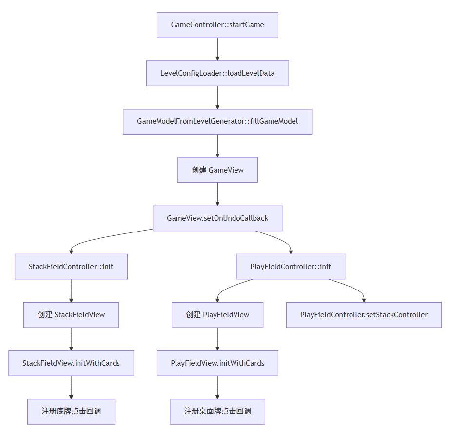

## 桌面牌点击流程

当用户点击桌面牌时：

1. PlayFieldView 触发点击事件，调用回调函数
2. PlayFieldController::handleCardClick() 处理点击
3. 调用 canMoveToStack()     判断是否可以移动
4. 通过     CardRuleService::canLink() 判断点数差是否为1
5. 如果可以移动，调用     replaceTrayWithPlayFieldCard()
6. 调用     StackFieldController::pushCardToTop() 添加到手牌区顶部

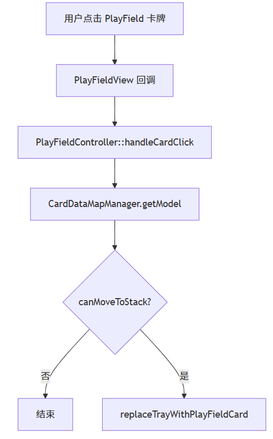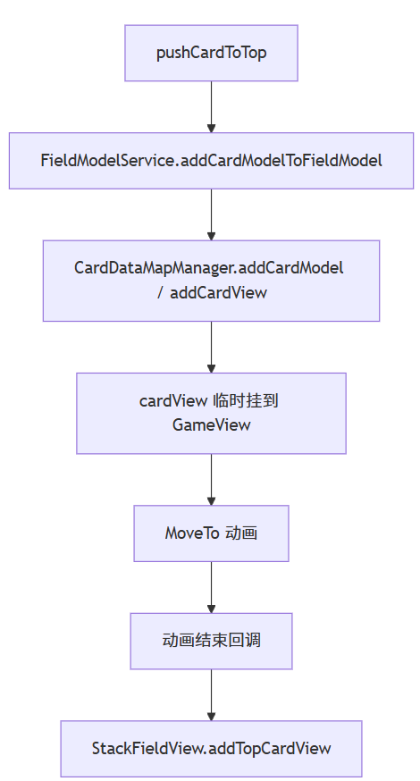

## 手牌区翻牌流程

当用户点击手牌区底牌时：

1. StackFieldView 触发底牌点击事件
2. StackFieldController::bringBottomCardToTop() 处理
3. 记录撤销步骤（BottomToTop类型）
4. 移除底牌视图，添加到顶牌区
5. 播放移动动画到顶部位置

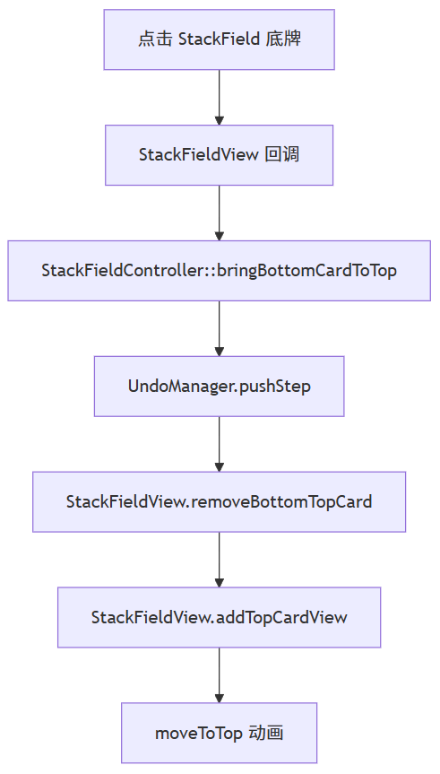

## 撤销流程

当用户点击撤销按钮时：

1. GameController::onUndoPressed() 被调用
2. 检查     UndoManager::canUndo()
3. 弹出 UndoStep，根据类型分发
4. PlayToStack 类型：调用 PlayFieldController::undoMoveFromStack()
5. BottomToTop 类型：调用 StackFieldController::undoBottomToTop()

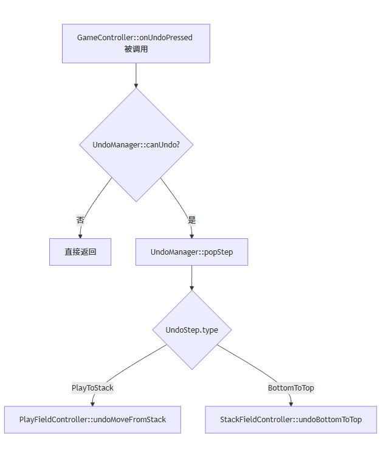